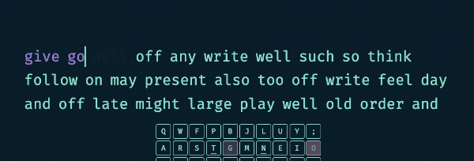
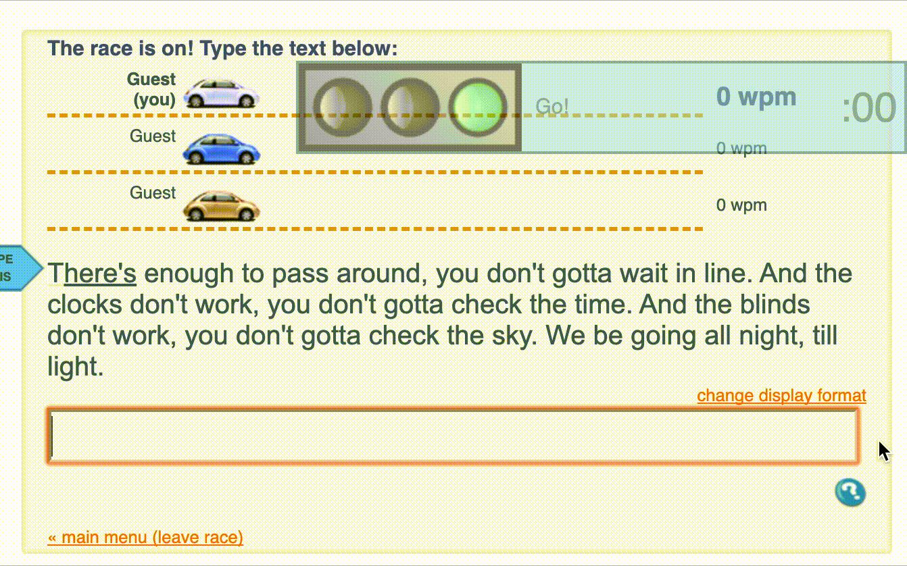
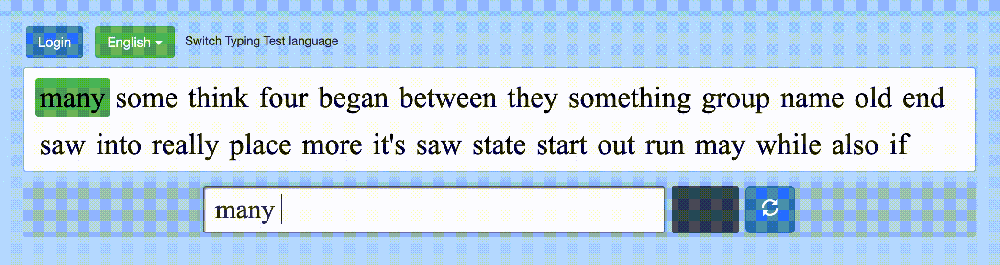
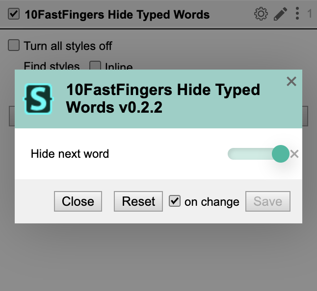
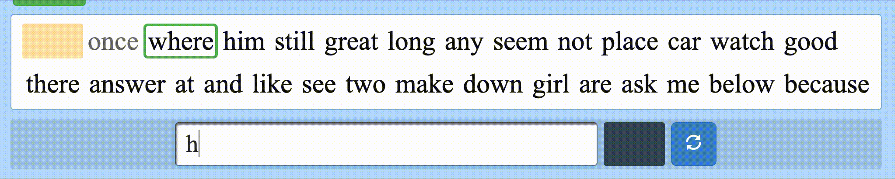

# Userstyles

UserCSS with [Stylus Extension](https://github.com/openstyles/stylus/)

## Styles

### Monkeytype : Read ahead with fade out time

### Typeracer : Hide Typed Words

### 10FastFingers : Hide Typed Words

- Hide next word mode

